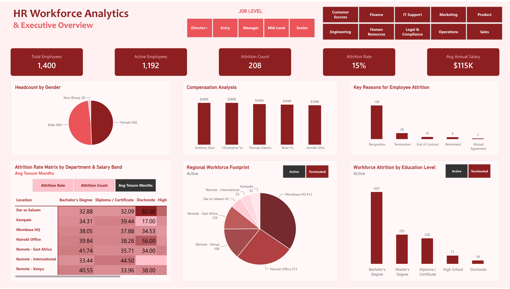

# 👥 HR Workforce Analytics & Executive Overview

An interactive **HR analytics dashboard** built with **Power BI**, providing a comprehensive executive overview of workforce composition, attrition patterns, compensation, regional footprint, and key employee metrics.

---

## 📊 Live Dashboard

👉 **[View the Live Dashboard](https://app.powerbi.com/view?r=eyJrIjoiZjgwMGYzNzEtY2RlMy00ZmQ4LWIyNTctMjFmNmNjMjM5NTk1IiwidCI6IjA3M2U1ODhkLTI4NmMtNDAwNS04ZmYwLWYyYWMzYzhlYTRkMyJ9)**  


---

## 📁 Project Structure

```text
HR-Workforce-Analytics/
│
├── HR_Workforce_Analytics_Data.csv          # Source dataset
├── HR_Workforcepbix    # Power BI report file
├── HR WORKFORCE.jpg               # Dashboard preview screenshot
└── README.md
```


## 🗂️ Dataset Overview

**Source file:** HR_Workforce_Data.csv — Simulated HR workforce records covering employee demographics, job levels, departments, compensation, tenure, attrition, and location data for an East African-focused organization.

| Column              | Type    | Description                                      |
| ------------------- | ------- | ------------------------------------------------ |
| Employee ID         | Integer | Unique employee identifier                       |
| Full Name           | String  | Employee full name                               |
| Gender              | String  | Male, Female, or Non-Binary                      |
| Job Level           | String  | Director+, Senior, Manager, Mid-Level, Entry     |
| Department          | String  | Department (e.g. Engineering, Sales, HR, etc.)   |
| Location            | String  | Office or remote location                        |
| Education Level     | String  | Highest education qualification                  |
| Annual Salary       | Decimal | Annual salary in USD                             |
| Tenure (Months)     | Integer | Length of service in months                      |
| Employment Status   | String  | Active or Terminated                             |
| Attrition Reason    | String  | Reason for leaving (if applicable)               |
| Hire Date           | Date    | Date the employee joined                         |
| Termination Date    | Date    | Date of termination (if applicable)              |


## 📈 Dashboard Features

### KPI Cards

- Total Employees → 1,400
- Active Employees → 1,192
- Attrition Count → 208
- Attrition Rate → 15%
- Average Annual Salary → $115K

### Filters / Slicers

- Job Level (Director+, Entry, Manager, Mid-Level, Senior)
- Department (Customer Success, Finance, IT Support, Marketing, Product, Engineering, Human Resources, Legal & Compliance, Operations, Sales)

---

## 🔑 Key Insights

1. Balanced gender distribution with a slight majority of female employees and a small non-binary representation.
2. Resignation is the dominant attrition driver (158 out of 208 cases), highlighting the need for retention strategies.
3. Mombasa HQ and Nairobi Office form the largest physical hubs, while remote workers (especially Remote – Kenya and Remote – East Africa) make up a significant portion of the workforce.
4. Bachelor’s degree holders represent the largest education group, both in active and overall headcount.
5. Attrition rates and average tenure vary significantly by location and education level, offering clear targets for talent management interventions.
6. Interactive job level and department filters allow executives to drill down into specific segments of the workforce.

---

## 🛠️ Tools Used

| Tool | Purpose |
|---|---|
| Power BI Desktop | Dashboard development and visualization |
| DAX | KPI calculations and measures |
| Power Query (M) | Data cleaning and transformation |
| Microsoft Excel | Source dataset |

---

## 🚀 How to Use

1. **Clone this repository**

```bash
git clone https://github.com/Omar-Hassan-Analyst/HR-Workforce-Analytics-Executive-Overview.git
```


2. **Open the dataset in Power BI**

- Load HR_Workforce_Data.csv
- Connect it to your Power BI report if recreating the dashboard

3. **Or explore the published dashboard online**

👉 **[Live Power BI Dashboard](https://app.powerbi.com/view?r=eyJrIjoiZDZiYzBjY2EtZGZlZC00ZjgwLWI5OGEtMGNlMzU5ODJhYzA4IiwidCI6IjA3M2U1ODhkLTI4NmMtNDAwNS04ZmYwLWYyYWMzYzhlYTRkMyJ9)**

---

## 📷 Preview



---

## 📄 Licence

This project was developed for portfolio and educational purposes. The dataset is simulated and created to demonstrate HR analytics, workforce insights, attrition analysis, and interactive dashboard design using Power BI.

---

